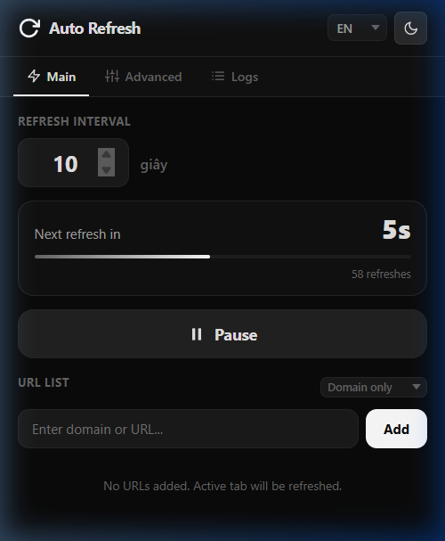
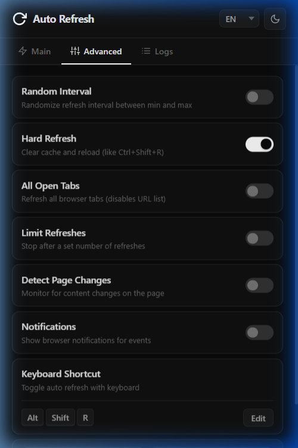
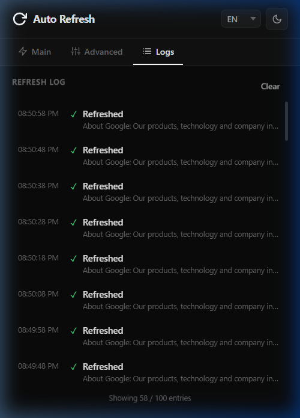
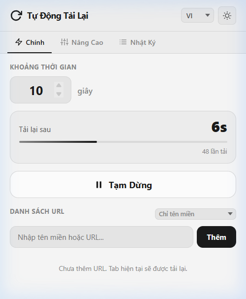

<p align="center">
  
</p>

<h1 align="center">Auto Refresh Pro</h1>

<p align="center">
  <strong>A powerful Chrome extension for automatically refreshing pages at customizable intervals.</strong><br>
  Premium dark/light UI · 8 Languages · Advanced features
</p>

<p align="center">
  
  
  
</p>

---

## 📸 Screenshots

<table>
  <tr>
    <td align="center"><strong>Main (Dark)</strong></td>
    <td align="center"><strong>Advanced (Dark)</strong></td>
    <td align="center"><strong>Logs (Dark)</strong></td>
    <td align="center"><strong>Main (Light)</strong></td>
  </tr>
  <tr>
    <td></td>
    <td></td>
    <td></td>
    <td></td>
  </tr>
</table>

---

## ✨ Features

### Core
- ⏱ **Configurable refresh interval** — 1 second to 24 hours
- ⏸ **Start / Pause** toggle with a single click
- 🔢 **Live countdown** timer with animated progress bar
- 🔴 **Badge countdown** on the extension icon
- 🔗 **URL list** match with regexp

### Advanced
- 🎲 **Random interval** — randomize between configurable min/max values
- 🧹 **Hard refresh** — clears origin cache and reloads (like `Ctrl+Shift+R`)
- 📑 **All open tabs** — refresh every tab at once (disables URL list)
- 🔄 **Refresh limit** — auto-stop after N refreshes
- 👁 **Page change detection** — detects when page content changes, with actions:
  - Notify via browser notification
  - Stop refreshing automatically
- 🔔 **Notifications** — browser notifications for events
- ⌨️ **Keyboard shortcut** — customizable hotkey (default: `Alt+Shift+R`)
- 📤 **Export / Import** — backup and restore all settings as JSON

### UI / UX
- 🌙 **Dark / Light / System** theme with smooth transitions
- 🌐 **8 Languages**: English, Tiếng Việt, 中文, 日本語, 한국어, Français, Español, Deutsch
- 📋 **Refresh log** — timestamped history (100 entries, clears on browser close)
- 🎨 **Premium design** — neutral color palette, micro-animations, custom toggle switches

---

## 🚀 Installation

### From source (Developer mode)

1. **Download** or clone this repository
2. Open Chrome and go to `chrome://extensions`
3. Enable **Developer mode** (toggle in the top-right corner)
4. Click **Load unpacked**
5. Select the `Auto Refresh` folder
6. The extension icon appears in your toolbar — click it to get started!

---

## 📖 Usage

### Quick Start

1. Click the **Auto Refresh** icon in your toolbar
2. Set your desired **refresh interval** (default: 10 seconds)
3. Click **▶ Start** — the page will auto-refresh
4. Click **⏸ Pause** to stop

### URL Matching

By default, only the **active tab** is refreshed. To target specific sites:

1. Enter a RegExp for URL
2. Click **Add**

### Keyboard Shortcut

- Default: `Alt + Shift + R` to toggle auto-refresh
- Customize via **Advanced** → **Keyboard Shortcut** → **Edit**

### Export / Import Settings

- **Export**: Advanced tab → Export Settings → downloads a `.json` file
- **Import**: Advanced tab → Import Settings → select your `.json` file

---

## 🏗 Project Structure

```
Auto Refresh/
├── manifest.json           # Extension manifest (MV3)
├── background.js           # Service worker — timer engine, refresh logic
├── content.js              # Content script — page hash, keyboard shortcut
├── popup/
│   ├── popup.html          # Popup UI (3 tabs)
│   ├── popup.css           # Themed styles (dark/light)
│   └── popup.js            # UI controller
├── utils/
│   ├── storage.js          # chrome.storage wrapper
│   └── i18n.js             # Runtime i18n module
├── locales/
│   ├── en.json             # English
│   ├── vi.json             # Vietnamese
│   ├── zh.json             # Chinese (Simplified)
│   ├── ja.json             # Japanese
│   ├── ko.json             # Korean
│   ├── fr.json             # French
│   ├── es.json             # Spanish
│   └── de.json             # German
├── icons/
│   ├── icon16.png
│   ├── icon32.png
│   ├── icon48.png
│   └── icon128.png
└── screenshots/            # README images
```

---

## 🔧 Technical Details

| Aspect | Implementation |
|---|---|
| **Manifest** | V3 (service worker, no background page) |
| **Timer** | `setInterval` (1s ticks) + `chrome.alarms` keep-alive |
| **State Recovery** | `chrome.storage.session` persists countdown across SW restarts |
| **Settings** | `chrome.storage.local` — survives browser restart |
| **Logs** | `chrome.storage.session` — cleared on browser close |
| **Hard Refresh** | `chrome.browsingData.remove({origins}, {cache})` + `bypassCache: true` |
| **Page Detection** | Content script hashes `document.body.innerText` |
| **i18n** | Custom runtime module (not Chrome `_locales`) for instant switching |

### Permissions Used

| Permission | Purpose |
|---|---|
| `tabs` | Query and reload browser tabs |
| `storage` | Save settings and logs |
| `alarms` | Keep service worker alive |
| `browsingData` | Clear cache for hard refresh |
| `notifications` | Browser notifications |
| `activeTab` | Access current tab info |
| `scripting` | Inject content scripts on demand |

---

## 🌐 Adding a New Language

1. Create a new file in `locales/` (e.g. `pt.json`) based on `en.json`
2. Translate all string values
3. Add the language option in `popup/popup.html`:
   ```html
   <option value="pt">PT</option>
   ```
4. Reload the extension

---

## 📄 License

This project is licensed under the MIT License.

---

<p align="center">
  Made with ❤️ for productivity
</p>
